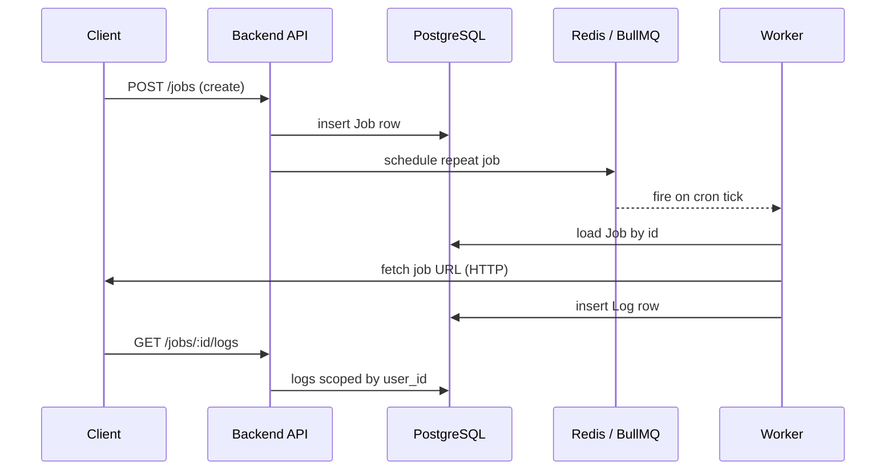

# Architecture

Crono is a TypeScript monorepo: one Express API, one BullMQ worker, one Next.js frontend, shared packages for DB/queue/utils.

## Monorepo layout

```txt
Crono/
├── apps/backend/     Express API — auth, jobs, logs
├── apps/worker/      BullMQ consumer — HTTP executor
├── apps/frontend/    Next.js dashboard + landing
├── packages/db/      Prisma schema + client
├── packages/queue/   Redis + BullMQ scheduler helpers
└── packages/shared/  API keys, cron validation, plan limits
```

## Backend layers

Every API feature follows the same stack:

```txt
HTTP Request
  → Route        (path, middleware, validation)
  → Controller   (read req, call service, send JSON)
  → Service      (business rules, throw ApiError)
  → Repository   (Prisma queries only)
  → PostgreSQL
```

**Rules**

- Prisma lives **only** in repositories — never in controllers or services.
- Services never touch `req` / `res`.
- Controllers never query the database directly.
- Validation uses Zod schemas + `validate` middleware before the controller.

## How a job runs



1. **Create job** — API validates cron + plan limit, saves `Job`, calls scheduler to add a BullMQ repeat job. `bull_job_id` is stored on the row.
2. **Pause / delete** — API updates DB and removes or pauses the BullMQ repeat job.
3. **Worker tick** — Worker receives `{ jobId }` from the queue, loads the job, skips if missing or not `active`, runs `fetch` against the URL, writes a `Log` row (`success` or `failed`).
4. **Read logs** — API checks job ownership (`user_id`), returns logs newest first.

## Data model

| Model | Purpose |
|-------|---------|
| `User` | Account, `plan`, `api_key`, password hash |
| `Job` | Schedule, URL, method, headers, `status`, `bull_job_id` |
| `Log` | One row per execution — status, HTTP code, duration, body snippet |

Tenant isolation: every `Job` and `Log` query filters by `user_id`. Cross-user access returns 404, not 403, so IDs are not leaked.

## Auth

| Method | Header | Used by |
|--------|--------|---------|
| JWT | `Authorization: Bearer …` | Dashboard |
| API key | `x-api-key: cron_…` | Scripts / CI |

JWT is signed with `JWT_SECRET`. API keys are generated at register and stored on the user row.

## Plan limits

Enforced in `job.service` on create — not billing integration:

| Plan | Max active jobs |
|------|-----------------|
| free | 3 |
| starter | 50 |
| pro | 500 |

## Processes you run locally

| Process | Port / role |
|---------|-------------|
| `backend` | `:4000` — REST API |
| `worker` | no HTTP — consumes `cron-jobs` queue |
| `frontend` | `:3000` — Next.js |
| Postgres | `:5433` (docker) |
| Redis | `:6379` (docker) |

All apps read env from the repo root `.env`.
